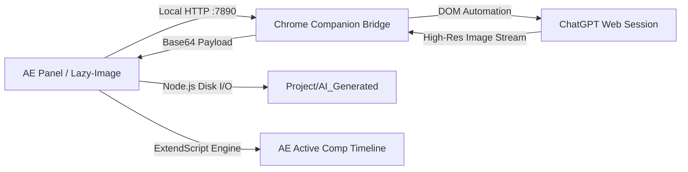

# Lazy-Image — After Effects Extension 🎨✨

> **AI Image Generation directly inside Adobe After Effects using your existing ChatGPT account — No API keys or extra billing required!**

Developed with ❤️ by **[Raisul Sohan](https://github.com/raisulsohan)**

---

## 🌟 Overview

**Lazy-Image** is a native Adobe After Effects CEP extension that seamlessly integrates AI image generation into your motion design and visual effects workflow. 

Instead of paying for expensive API credits or juggling between browser tabs and file explorers, **Lazy-Image** connects directly to your active browser session on **ChatGPT**, generates the image according to your prompt and aspect ratio, saves it inside your After Effects project folder, and **automatically places it onto your active composition timeline at the current playhead position.**

---

## ✨ Key Features

- 🔑 **No API Key Required**: Works directly with your active ChatGPT (Free / Plus / Pro) login session in Google Chrome.
- ⏱️ **Auto-Import to Timeline**: Automatically imports generated images into the project bin and adds them as layers at your current timeline playhead (`comp.time`).
- 📂 **Smart Project Organization**: Automatically discovers your open `.aep` project directory and neatly saves images in an `AI_Generated` subfolder.
- 🌍 **Multilingual Prompt Support**: Type your prompts in any language (English, বাংলা, हिन्दी, العربية, Español, etc.) without encoding issues.
- 📐 **Aspect Ratio Presets**: Quick one-click ratios (`1:1`, `16:9`, `9:16`, `4:5`) plus custom resolution controls (`W:H`).
- 📋 **Quick Action Buttons**:
  - **📋 Copy Image**: Instantly copy high-res image to clipboard via native Windows bridge.
  - **📂 Open Folder**: Open the containing folder in Windows Explorer with one click.
- 🌙 **Modern Dark UI**: Designed to match Adobe After Effects' native aesthetic.

---

## 🏗️ Architecture



1. **CEP Panel (`client/`)**: Embedded Chromium & Node.js environment inside After Effects hosting a lightweight local server on `127.0.0.1:7890`.
2. **Companion Extension (`chrome-extension/`)**: A Manifest V3 Chrome service worker that bridges requests from AE to ChatGPT.
3. **ExtendScript Engine (`host/`)**: Automates After Effects project file imports and timeline layer insertion.

---

## 🚀 Installation & Setup

### Prerequisites
- **Adobe After Effects**: CC 2019 to 2026 (Windows)
- **Google Chrome**: With an active login session at [chatgpt.com](https://chatgpt.com)

---

### Step 1: Install the After Effects Panel

1. Clone or download this repository:
   ```bash
   git clone https://github.com/raisulsohan/LazyImageGeneration.git
   ```
2. Double-click **`install.bat`** (or right-click and select **Run as Administrator**).
   - This enables Adobe CEP `PlayerDebugMode` in the Windows registry.
   - Creates a symbolic link directly to `%APPDATA%\Adobe\CEP\extensions\com.gimage.aftereffects`.

---

### Step 2: Install the Chrome Companion Bridge

1. Open **Google Chrome** and navigate to `chrome://extensions/`.
2. Turn ON **Developer mode** (toggle in the top-right corner).
3. Click **Load unpacked** (top-left).
4. Select the **`chrome-extension`** folder inside the cloned repository directory.
5. Ensure you are logged into [chatgpt.com](https://chatgpt.com) in your Chrome browser.

---

### Step 3: Launch in After Effects

1. Open **Adobe After Effects**.
2. Go to top menu: **Window** > **Extensions** > **Lazy-Image — After Effects**.
3. The panel will open and display a green **Connected** badge in the top right.

---

## 🎬 How to Use

1. **Open or Save a Project**: Save your After Effects project (`.aep`) so Lazy-Image knows where to store your generated assets.
2. **Open a Composition**: Open the composition you want the image to be placed into.
3. **Write Your Prompt**: Type your image description in the prompt box (in any language).
4. **Choose Aspect Ratio**: Select `1:1`, `16:9`, `9:16`, `4:5`, or enter a custom ratio.
5. **Click "✨ Generate Image"** (or press `Ctrl + Enter`).
6. **Watch the Magic**: The image will be generated, saved to `<YourProjectFolder>/AI_Generated/`, and inserted directly into your timeline at your playhead position!

---

## 📁 Project Structure

```
LazyImageGeneration/
├── CSXS/
│   └── manifest.xml          # Adobe CEP extension manifest
├── client/
│   ├── css/
│   │   └── style.css         # Dark theme UI styling
│   ├── js/
│   │   ├── CSInterface.js    # Adobe CEP ExtendScript bridge
│   │   ├── main.js           # Main controller & local HTTP server
│   │   └── utils/
│   │       └── storage.js    # Persistent settings manager
│   └── index.html            # Extension panel interface
├── chrome-extension/
│   ├── background.js         # Manifest V3 service worker & polling bridge
│   ├── content-chatgpt.js    # ChatGPT DOM automation script
│   ├── popup.html / popup.js # Extension status monitor popup
│   └── manifest.json         # Chrome extension configuration
├── host/
│   └── index.jsx             # After Effects ExtendScript automation
├── install.bat               # 1-click Windows installer script
└── README.md                 # Documentation
```

---

## ❓ Frequently Asked Questions & Troubleshooting

<details>
<summary><b>Why does the status say "Disconnected"?</b></summary>

- Ensure Google Chrome is open and the **Lazy-Image Bridge** extension is enabled in `chrome://extensions`.
- Make sure you are logged into [chatgpt.com](https://chatgpt.com).
</details>

<details>
<summary><b>Where are the images saved on my computer?</b></summary>

- If you have saved your `.aep` project file, images are saved directly in `<Project_Folder>/AI_Generated/`.
- If your project is not yet saved, it falls back safely to `Documents/GImage_Generated/`.
</details>

<details>
<summary><b>Can I write prompts in Bengali or other languages?</b></summary>

Yes! Lazy-Image fully supports UTF-8 Unicode. You can write prompts in বাংলা, English, or any language supported by ChatGPT.
</details>

---

## 👨‍💻 Author

**Raisul Sohan**
- GitHub: [@raisulsohan](https://github.com/raisulsohan)

---

## 📄 License

This project is open source and available under the [MIT License](LICENSE).
