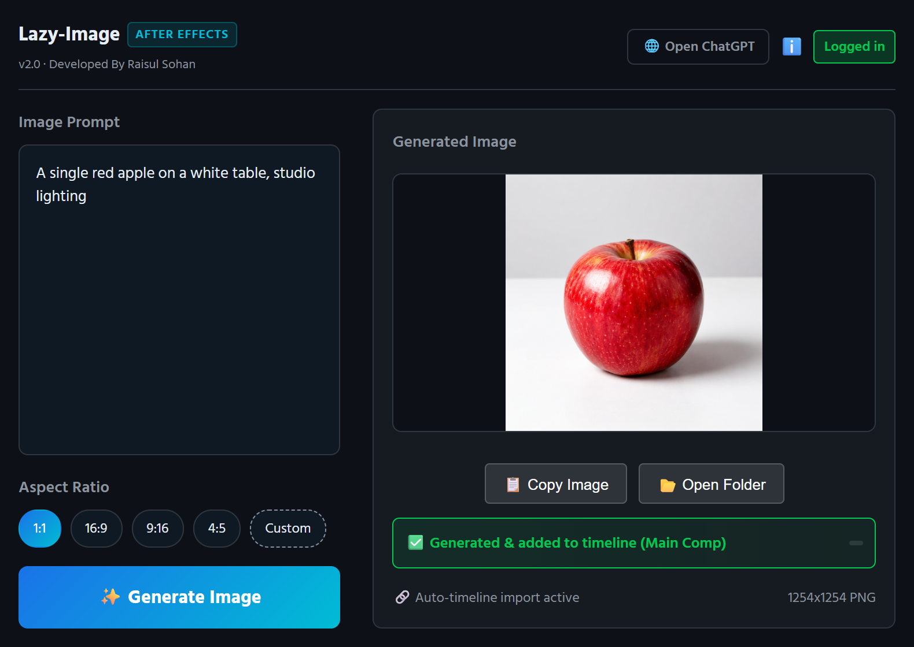
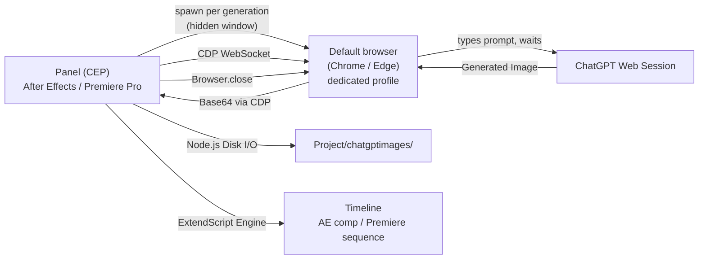

# Lazy-Image — After Effects & Premiere Pro Extension 🎨✨

> **AI Image Generation directly inside Adobe After Effects and Premiere Pro using your existing ChatGPT account — No API keys, no Chrome Extension, no extra billing required!**

Developed with ❤️ by **[Raisul Sohan](https://raisulsohan.com)** · **Version 2.2**

---

<p align="center">
  
</p>

---

## 🆕 What's New

### 2.2

- **Premiere Pro support** — the same panel and features now run in Premiere Pro too. Images go into a `ChatGptImages` bin and onto a free video track at the playhead, without overwriting any clip.
- **One extension for both apps** — open it from **Window › Extensions › Lazy-Image** in After Effects or Premiere Pro; the ChatGPT login is shared.

### 2.1

- **Uses your default browser** — Chrome, Edge, Brave or Vivaldi, whichever Windows is set to.
- **`ChatGptImages` folder in the Project panel** — every imported image is collected there.
- **Progress percentage** while ChatGPT creates the image (an estimate — ChatGPT doesn't report real progress).

### 2.0

- **Invisible, on-demand ChatGPT** — no browser window during generation; the browser starts hidden for each image and closes right after. Replaces the Chrome extension from 1.x.
- **One-time login** in a normal browser window that closes by itself once you're logged in.
- **Never steals keyboard focus** from After Effects.
- **`chatgptimages` folder** created automatically next to your project file, with an "Image removed" tip when an image is deleted from it.
- **Cancel button** to stop a running generation.
- Updated for ChatGPT's current web interface.

---

## 🌟 Overview

**Lazy-Image** is a native Adobe CEP extension for **After Effects** and **Premiere Pro** that seamlessly integrates AI image generation into your motion design, editing, and visual effects workflow. 

Instead of paying for expensive API credits or juggling between browser tabs and file explorers, **Lazy-Image** drives **ChatGPT** through an invisible instance of your default browser (Chrome or Edge) via the **Chrome DevTools Protocol (CDP)**, generates the image according to your prompt and aspect ratio, saves it inside your project folder, and **automatically places it onto your timeline at the current playhead position** — as a layer in the active After Effects composition, or as a clip in the active Premiere Pro sequence.

> **Stay inside your editor.** A browser window appears only once, when you first log in. After that, the browser is started invisibly only while an image is being generated and closes again as soon as it's done — nothing keeps running in the background.

---

## ✨ Key Features

- 🎞️ **After Effects & Premiere Pro**: One extension for both apps — the same panel and features in each.
- 🔑 **No API Key Required**: Works directly with your ChatGPT (Free / Plus / Pro) account.
- 🙈 **Invisible & On-Demand**: No browser window, no taskbar button, no background process — the browser runs hidden only during a generation, then exits.
- 🌐 **Your Default Browser**: Uses whichever browser Windows is set to — Chrome, Edge, Brave or Vivaldi (falls back to Chrome, then Edge, for non-Chromium browsers like Firefox).
- 🚫 **No Browser Extension**: Controls the browser directly via CDP — zero extension setup, zero friction.
- 🔐 **One-Time Login**: Log in to ChatGPT once in a normal browser window — your session is saved in a dedicated Lazy-Image profile and the window closes by itself.
- ⏹️ **Cancelable**: Stop a running generation at any time from the panel.
- ⏱️ **Auto-Import to Timeline**: Imports every generated image into a `ChatGptImages` folder (After Effects) or bin (Premiere Pro) and places it at the current playhead — as a new layer in After Effects, or on a free video track above your footage in Premiere Pro.
- 📂 **Smart Project Organization**: Automatically creates a `chatgptimages` folder next to your open `.aep` or `.prproj` project file and saves every image there.
- 🗑️ **Removal Tip**: If an image is deleted from that folder, the panel shows a short "Image removed" notification.
- 🌍 **Multilingual Prompt Support**: Type your prompts in any language (English, বাংলা, हिन्दी, العربية, Español, etc.) without encoding issues.
- 📐 **Aspect Ratio Presets**: Quick one-click ratios (`1:1`, `16:9`, `9:16`, `4:5`) plus custom resolution controls (`W:H`).
- 📋 **Quick Action Buttons**:
  - **📋 Copy Image**: Instantly copy high-res image to clipboard via native Windows bridge.
  - **📂 Open Folder**: Open the containing folder in Windows Explorer with one click.
- 🌙 **Modern Dark UI**: Designed to match the native look of After Effects and Premiere Pro.

---

## 🏗️ Architecture


```mermaid
graph LR
    A["Panel (CEP)<br/>After Effects / Premiere Pro"] -- "spawn per generation<br/>(hidden window)" --> B["Default browser<br/>(Chrome / Edge)<br/>dedicated profile"]
    A -- "CDP WebSocket" --> B
    B -- "types prompt, waits" --> C["ChatGPT Web Session"]
    C -- "Generated Image" --> B
    B -- "Base64 via CDP" --> A
    A -- "Browser.close" --> B
    A -- "Node.js Disk I/O" --> D["Project/chatgptimages/"]
    A -- "ExtendScript Engine" --> E["Timeline<br/>AE comp / Premiere sequence"]
```

1. **CEP Panel (`client/`)**: Embedded Chromium & Node.js environment inside After Effects and Premiere Pro. The panel detects which app it runs in.
2. **Browser Bridge (`client/js/browser-bridge.js`)**: For each generation it starts your default browser (Chrome or Edge) with a hidden window on a dedicated Lazy-Image profile, types the prompt into ChatGPT, waits for the finished image, downloads it, and closes the browser again. For the one-time login it opens a normal, visible window instead — all without any browser extension.
3. **ExtendScript Engine**: Imports the image into the project and places it on the timeline — a layer in After Effects, a clip in Premiere Pro. `client/js/main.js` builds the script for whichever app the panel runs in.

---

## 🚀 Installation & Setup

### Prerequisites
- **Adobe After Effects** (CC 2019 to 2026) and/or **Adobe Premiere Pro** (CC 2019 to 2026), on Windows
- **Google Chrome or Microsoft Edge**: Lazy-Image uses your Windows default browser if it's Chromium-based (Chrome, Edge, Brave, Vivaldi); otherwise it uses Chrome, or Edge, which ships with Windows

---

### Step 1: Install the Panel

1. Clone or download this repository:
   ```bash
   git clone https://github.com/raisulsohan/LazyImageGeneration.git
   ```
2. Double-click **`install.bat`** (or right-click and select **Run as Administrator**).
   - This enables Adobe CEP `PlayerDebugMode` in the Windows registry.
   - Creates a symbolic link directly to `%APPDATA%\Adobe\CEP\extensions\com.gimage.aftereffects`.

---

### Step 2: Launch in After Effects or Premiere Pro

1. Open **Adobe After Effects** or **Adobe Premiere Pro**.
2. Go to top menu: **Window** > **Extensions** > **Lazy-Image**.
3. Click the **"🌐 Login to ChatGPT"** button in the panel header.
4. A window of your default browser opens with ChatGPT — **log in with your account** (you only need to do this once).
5. As soon as you're logged in, the window closes by itself and the panel shows a green **Logged in** badge. The login is shared — log in once and it works in both apps.

---

## 🎬 How to Use

1. **Open or Save a Project**: Save your project (`.aep` or `.prproj`) so Lazy-Image knows where to store your generated assets.
2. **Open a Composition or Sequence**: Open the After Effects composition or Premiere Pro sequence you want the image to be placed into.
3. **Write Your Prompt**: Type your image description in the prompt box (in any language).
4. **Choose Aspect Ratio**: Select `1:1`, `16:9`, `9:16`, `4:5`, or enter a custom ratio.
5. **Click "✨ Generate Image"** (or press `Ctrl + Enter`). No browser window appears — the status bar shows progress, and **✕ Cancel** stops it.
6. **Watch the Magic**: The image will be generated, saved to `<YourProjectFolder>/chatgptimages/`, and inserted directly into your timeline at your playhead position!
   - In Premiere Pro the image goes on the first video track above the clips under the playhead (a new track is added if needed), so nothing on your timeline is overwritten.

---

## 📁 Project Structure

```
LazyImageGeneration/
├── assets/
│   └── preview-v2.png           # Extension UI preview screenshot
├── CSXS/
│   └── manifest.xml             # Adobe CEP extension manifest
├── client/
│   ├── css/
│   │   └── style.css            # Dark theme UI styling
│   ├── js/
│   │   ├── CSInterface.js       # Adobe CEP ExtendScript bridge
│   │   ├── browser-bridge.js    # CDP browser automation (replaces the Chrome Extension)
│   │   ├── main.js              # Main controller & UI logic
│   │   └── utils/
│   │       └── storage.js       # Persistent settings manager
│   └── index.html               # Extension panel interface
├── host/
│   └── index.jsx                # After Effects ExtendScript automation
├── install.bat                  # 1-click Windows installer script
└── README.md                    # Documentation
```

---

## ❓ Frequently Asked Questions & Troubleshooting

<details>
<summary><b>Why does the status say "Login required"?</b></summary>

- You haven't logged in yet, or your ChatGPT session expired.
- Click the **"🌐 Login to ChatGPT"** button — a window of your default browser opens where you can log in. It closes by itself once you're done.
- If you change your default browser (e.g. from Chrome to Edge), log in once more — each browser keeps its own Lazy-Image session.
</details>

<details>
<summary><b>Does the browser keep running in the background?</b></summary>

No. The browser is started only when you click **Generate**, runs with a hidden window (no taskbar button, it doesn't take focus from After Effects or Premiere Pro), and is closed as soon as the image is downloaded — or when you press **✕ Cancel** or close the panel.
</details>

<details>
<summary><b>It says ChatGPT wants a verification or is showing a message.</b></summary>

Occasionally ChatGPT shows a human-verification check or a notice (e.g. updated terms) that needs a click. Click **"🌐 Open ChatGPT"** in the panel header, handle it in the browser window, close the window, and generate again.
</details>

<details>
<summary><b>Where are the images saved on my computer?</b></summary>

- If you have saved your `.aep` / `.prproj` project file, images are saved in `<Project_Folder>/chatgptimages/` (the folder is created automatically).
- If your project is not yet saved, they go to `Documents/chatgptimages/`.
</details>

<details>
<summary><b>Can I write prompts in Bengali or other languages?</b></summary>

Yes! Lazy-Image fully supports UTF-8 Unicode. You can write prompts in বাংলা, English, or any language supported by ChatGPT.
</details>

<details>
<summary><b>Does this interfere with my normal browsing?</b></summary>

No! Lazy-Image uses a **separate profile** of your browser, stored in `%APPDATA%\LazyImage` (e.g. `EdgeProfile` or `ChromeProfile`). Your regular browser, bookmarks, history, logins, and extensions remain completely unaffected — which is also why you log in to ChatGPT once inside Lazy-Image's own window.
</details>

---

## 👨‍💻 Author

**Raisul Sohan**
- Website: [raisulsohan.com](https://raisulsohan.com)
- GitHub: [@raisulsohan](https://github.com/raisulsohan)

---

## 📄 License

This project is open source and available under the [MIT License](LICENSE).
