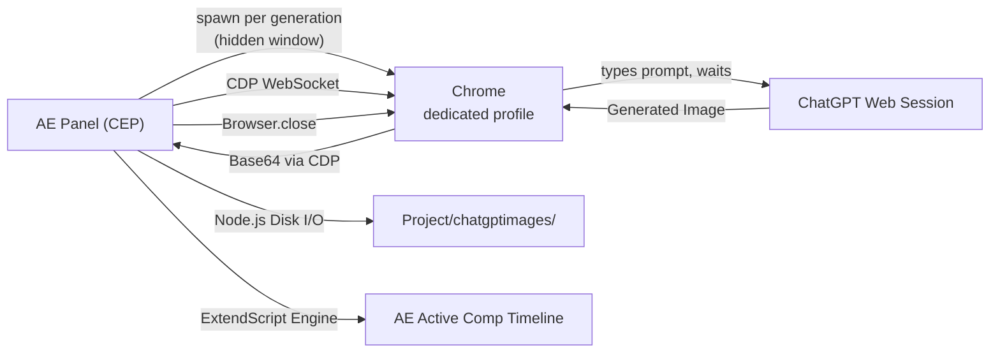

# Lazy-Image — After Effects Extension 🎨✨

> **AI Image Generation directly inside Adobe After Effects using your existing ChatGPT account — No API keys, no Chrome Extension, no extra billing required!**

Developed with ❤️ by **[Raisul Sohan](https://raisulsohan.com)**

---

<p align="center">
  
</p>

---

## 🌟 Overview

**Lazy-Image** is a native Adobe After Effects CEP extension that seamlessly integrates AI image generation into your motion design and visual effects workflow. 

Instead of paying for expensive API credits or juggling between browser tabs and file explorers, **Lazy-Image** drives **ChatGPT** through an invisible Chrome instance via the **Chrome DevTools Protocol (CDP)**, generates the image according to your prompt and aspect ratio, saves it inside your After Effects project folder, and **automatically places it onto your active composition timeline at the current playhead position.**

> **Stay inside After Effects.** A browser window appears only once, when you first log in. After that, Chrome is started invisibly only while an image is being generated and closes again as soon as it's done — nothing keeps running in the background.

---

## ✨ Key Features

- 🔑 **No API Key Required**: Works directly with your ChatGPT (Free / Plus / Pro) account.
- 🙈 **Invisible & On-Demand**: No browser window, no taskbar button, no background process — Chrome runs hidden only during a generation, then exits.
- 🚫 **No Chrome Extension**: Connects to Chrome directly via CDP — zero extension setup, zero friction.
- 🔐 **One-Time Login**: Log in to ChatGPT once in a normal browser window — your session is saved in a dedicated Chrome profile and the window closes by itself.
- ⏹️ **Cancelable**: Stop a running generation at any time from the panel.
- ⏱️ **Auto-Import to Timeline**: Automatically imports generated images into the project bin and adds them as layers at your current timeline playhead (`comp.time`).
- 📂 **Smart Project Organization**: Automatically creates a `chatgptimages` folder next to your open `.aep` project file and saves every image there.
- 🗑️ **Removal Tip**: If an image is deleted from that folder, the panel shows a short "Image removed" notification.
- 🌍 **Multilingual Prompt Support**: Type your prompts in any language (English, বাংলা, हिन्दी, العربية, Español, etc.) without encoding issues.
- 📐 **Aspect Ratio Presets**: Quick one-click ratios (`1:1`, `16:9`, `9:16`, `4:5`) plus custom resolution controls (`W:H`).
- 📋 **Quick Action Buttons**:
  - **📋 Copy Image**: Instantly copy high-res image to clipboard via native Windows bridge.
  - **📂 Open Folder**: Open the containing folder in Windows Explorer with one click.
- 🌙 **Modern Dark UI**: Designed to match Adobe After Effects' native aesthetic.

---

## 🏗️ Architecture


```mermaid
graph LR
    A["AE Panel (CEP)"] -- "spawn per generation<br/>(hidden window)" --> B["Chrome<br/>dedicated profile"]
    A -- "CDP WebSocket" --> B
    B -- "types prompt, waits" --> C["ChatGPT Web Session"]
    C -- "Generated Image" --> B
    B -- "Base64 via CDP" --> A
    A -- "Browser.close" --> B
    A -- "Node.js Disk I/O" --> D["Project/chatgptimages/"]
    A -- "ExtendScript Engine" --> E["AE Active Comp Timeline"]
```

1. **CEP Panel (`client/`)**: Embedded Chromium & Node.js environment inside After Effects.
2. **Browser Bridge (`client/js/browser-bridge.js`)**: For each generation it starts Chrome with a hidden window on the dedicated Lazy-Image profile, types the prompt into ChatGPT, waits for the finished image, downloads it, and closes Chrome again. For the one-time login it opens a normal, visible window instead — all without any Chrome Extension.
3. **ExtendScript Engine (`host/`)**: Automates After Effects project file imports and timeline layer insertion.

---

## 🚀 Installation & Setup

### Prerequisites
- **Adobe After Effects**: CC 2019 to 2026 (Windows)
- **Google Chrome**: Installed on your system

---

### Step 1: Install the After Effects Panel

1. Clone or download this repository:
   ```bash
   git clone https://github.com/raisulsohan/LazyImageGeneration.git
   ```
2. Double-click **`install.bat`** (or right-click and select **Run as Administrator**).
   - This enables Adobe CEP `PlayerDebugMode` in the Windows registry.
   - Creates a symbolic link directly to `%APPDATA%\Adobe\CEP\extensions\com.gimage.aftereffects`.

---

### Step 2: Launch in After Effects

1. Open **Adobe After Effects**.
2. Go to top menu: **Window** > **Extensions** > **Lazy-Image — After Effects**.
3. Click the **"🌐 Login to ChatGPT"** button in the panel header.
4. A Chrome window opens with ChatGPT — **log in with your account** (you only need to do this once).
5. As soon as you're logged in, the window closes by itself and the panel shows a green **Logged in** badge.

---

## 🎬 How to Use

1. **Open or Save a Project**: Save your After Effects project (`.aep`) so Lazy-Image knows where to store your generated assets.
2. **Open a Composition**: Open the composition you want the image to be placed into.
3. **Write Your Prompt**: Type your image description in the prompt box (in any language).
4. **Choose Aspect Ratio**: Select `1:1`, `16:9`, `9:16`, `4:5`, or enter a custom ratio.
5. **Click "✨ Generate Image"** (or press `Ctrl + Enter`). No browser window appears — the status bar shows progress, and **✕ Cancel** stops it.
6. **Watch the Magic**: The image will be generated, saved to `<YourProjectFolder>/chatgptimages/`, and inserted directly into your timeline at your playhead position!

---

## 📁 Project Structure

```
LazyImageGeneration/
├── assets/
│   └── preview.png              # Extension UI preview screenshot
├── CSXS/
│   └── manifest.xml             # Adobe CEP extension manifest
├── client/
│   ├── css/
│   │   └── style.css            # Dark theme UI styling
│   ├── js/
│   │   ├── CSInterface.js       # Adobe CEP ExtendScript bridge
│   │   ├── browser-bridge.js    # CDP-based Chrome automation (replaces Chrome Extension)
│   │   ├── main.js              # Main controller & UI logic
│   │   └── utils/
│   │       └── storage.js       # Persistent settings manager
│   └── index.html               # Extension panel interface
├── host/
│   └── index.jsx                # After Effects ExtendScript automation
├── install.bat                  # 1-click Windows installer script
└── README.md                    # Documentation
```

---

## ❓ Frequently Asked Questions & Troubleshooting

<details>
<summary><b>Why does the status say "Login required"?</b></summary>

- You haven't logged in yet, or your ChatGPT session expired.
- Click the **"🌐 Login to ChatGPT"** button — a Chrome window opens where you can log in. It closes by itself once you're done.
- Make sure Google Chrome is installed (Microsoft Edge is used as a fallback).
</details>

<details>
<summary><b>Does Chrome keep running in the background?</b></summary>

No. Chrome is started only when you click **Generate**, runs with a hidden window (no taskbar button, it doesn't take focus from After Effects), and is closed as soon as the image is downloaded — or when you press **✕ Cancel** or close the panel.
</details>

<details>
<summary><b>It says ChatGPT wants a verification or is showing a message.</b></summary>

Occasionally ChatGPT shows a human-verification check or a notice (e.g. updated terms) that needs a click. Click **"🌐 Open ChatGPT"** in the panel header, handle it in the browser window, close the window, and generate again.
</details>

<details>
<summary><b>Where are the images saved on my computer?</b></summary>

- If you have saved your `.aep` project file, images are saved in `<Project_Folder>/chatgptimages/` (the folder is created automatically).
- If your project is not yet saved, they go to `Documents/chatgptimages/`.
</details>

<details>
<summary><b>Can I write prompts in Bengali or other languages?</b></summary>

Yes! Lazy-Image fully supports UTF-8 Unicode. You can write prompts in বাংলা, English, or any language supported by ChatGPT.
</details>

<details>
<summary><b>Does this interfere with my normal Chrome browsing?</b></summary>

No! Lazy-Image uses a **separate Chrome profile** stored at `%APPDATA%\LazyImage\ChromeProfile`. Your regular Chrome browser, bookmarks, history, and extensions remain completely unaffected.
</details>

---

## 👨‍💻 Author

**Raisul Sohan**
- Website: [raisulsohan.com](https://raisulsohan.com)
- GitHub: [@raisulsohan](https://github.com/raisulsohan)

---

## 📄 License

This project is open source and available under the [MIT License](LICENSE).
