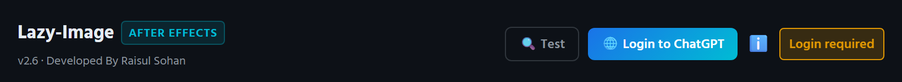
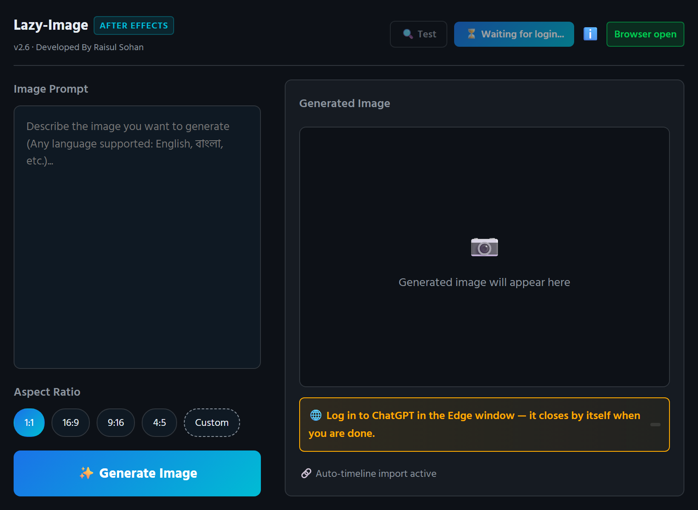
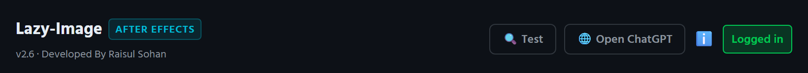
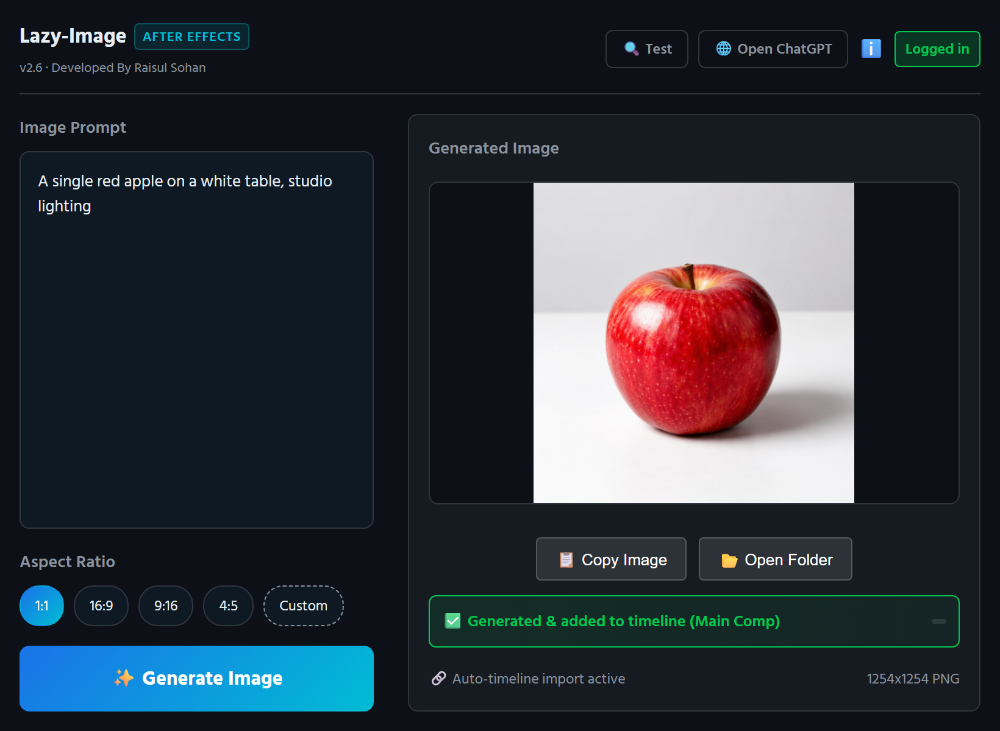
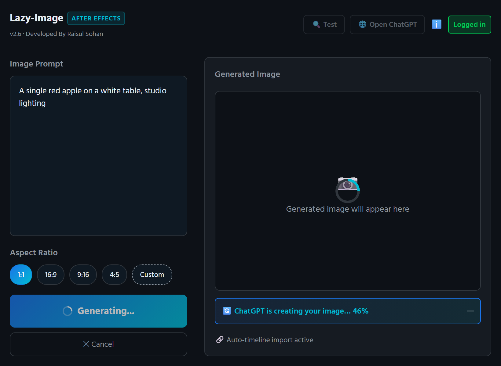
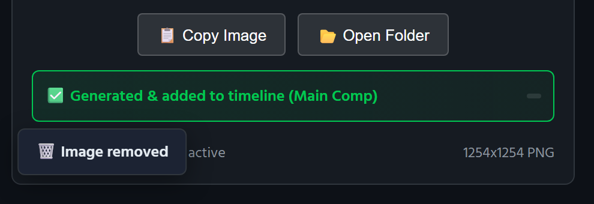
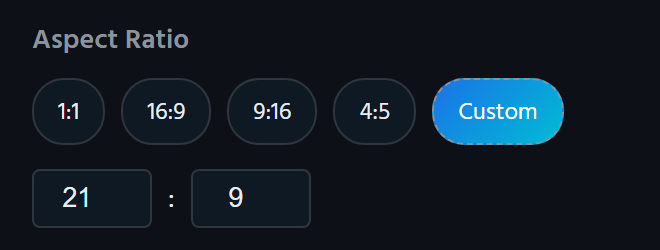

# The Lazy-Image manual

Everything the panel does, in the order you meet it. *Written for Lazy-Image
2.6.* For what happens behind the Generate button, see
[How it works](how-it-works.md); when something does not behave, see
[If something goes wrong](troubleshooting.md).

**Contents**

1. [What you need](#1-what-you-need)
2. [Install, update, uninstall](#2-install-update-uninstall)
3. [Log in to ChatGPT, once](#3-log-in-to-chatgpt-once)
4. [The panel at a glance](#4-the-panel-at-a-glance)
5. [Generate an image](#5-generate-an-image)
6. [Where the image goes](#6-where-the-image-goes)
7. [Aspect ratios](#7-aspect-ratios)
8. [Copy Image and Open Folder](#8-copy-image-and-open-folder)
9. [The Test button](#9-the-test-button)
10. [Cancelling](#10-cancelling)
11. [Keyboard shortcuts](#11-keyboard-shortcuts)
12. [Where your data is kept](#12-where-your-data-is-kept)
13. [Privacy](#13-privacy)

---

## 1. What you need

- **Windows 10 or 11.** Lazy-Image drives the browser through Windows-only
  tools (the registry, PowerShell, `taskkill`), so there is no macOS version.
- **After Effects CC 2019 (16.0) or newer** and/or **Premiere Pro CC 2019
  (13.0) or newer.** One install serves both apps.
- **A Chromium browser.** Lazy-Image uses whichever browser Windows has as
  its default if it is Chrome, Edge, Brave, Vivaldi or Chromium. If the
  default is something else (Firefox, say), it uses Chrome, and failing
  that Edge, which ships with Windows.
- **A ChatGPT account.** Free, Go, Plus or Pro all work; the images count
  against that account's own image limits, exactly as if you had typed the
  prompt on chatgpt.com yourself.

---

## 2. Install, update, uninstall

### Install or update

1. Download the newest **`Lazy-Image-v….zip`** from the
   [latest release](https://github.com/raisulsohan/LazyImageGeneration/releases/latest)
   and unzip it anywhere. The Desktop is fine.
2. Close After Effects and Premiere Pro. A running app holds on to the old
   panel's files.
3. Double-click **`install.bat`** in the unzipped folder. It waits for a key
   press, removes any older Lazy-Image, unpacks the new one and reports
   **Installed**.
4. Start the app and open **Window › Extensions › Lazy-Image**. Dock the
   panel wherever you like.

The panel inside the zip is a signed and timestamped `.zxp`, so Adobe loads
it without an extension manager and without its developer debug setting.
Installing over an older version replaces the panel and **keeps your ChatGPT
login**, which lives in a separate folder
([section 12](#12-where-your-data-is-kept)).

Where the installer puts the panel:

```
%APPDATA%\Adobe\CEP\extensions\com.gimage.aftereffects
```

The zip also holds **`installguide.txt`** (a short version of this page),
**`Fix a blank panel.bat`** (see
[the panel opens blank](troubleshooting.md#the-panel-opens-blank)) and
**`uninstall.bat`**.

### Uninstall

Run **`uninstall.bat`** with the Adobe apps closed. It removes the panel, then
**asks** whether to delete the saved ChatGPT login as well
(`%APPDATA%\LazyImage`). The images you generated are never touched; they
stay in the `chatgptimages` folders next to your projects.

Developers who want to run the panel from a clone of the repository: see
[Building from source](development.md#running-it-from-the-repository).

---

## 3. Log in to ChatGPT, once

Lazy-Image needs to be logged in to ChatGPT in its **own** browser profile.
That profile is separate from your everyday browser, so being logged in on
chatgpt.com in your normal browser is not enough, and nothing Lazy-Image does
touches your normal bookmarks, history or logins.



1. Open the panel. The badge in the header reads **Login required**.
2. Click **🌐 Login to ChatGPT**. A normal, visible window of your browser
   opens on ChatGPT's login page and comes to the front; the badge changes
   to **Browser open** and the status bar says which browser it is.
3. Log in as you always do: email and password, Google, Microsoft or Apple.
4. As soon as ChatGPT shows you as logged in, the window **closes by
   itself** and the badge turns green: **Logged in**. The status bar reads
   *Logged in to ChatGPT! Generate images right here — no browser needed.*





You will not need to do this again, unless ChatGPT ends the session, you
switch to a different default browser (each browser keeps its own
Lazy-Image profile and login), or you remove the saved login with the
uninstaller. The login is shared by After Effects and Premiere Pro: log in
once and both apps are ready.

**If the window was already logged in** (you clicked the button a second
time, say), the status bar says so and the window stays open until you close
it. That is also how you handle a verification or a notice from ChatGPT: see
[the troubleshooting page](troubleshooting.md#chatgpt-wants-a-quick-human-verification).

**If you close the window before logging in**, Lazy-Image checks quietly
in the background whether the login went through after all, and reports
*Login was not completed* if it did not. The login window gives up after 15
minutes.

Once logged in, the same button reads **🌐 Open ChatGPT**. It is only needed
to switch accounts (log out inside that window and log in again) or to deal
with something ChatGPT is showing.

---

## 4. The panel at a glance



**Header**

- **Lazy-Image** and a tag saying which app you are in: **After Effects** or
  **Premiere Pro**. Under it, the version.
- **🔍 Test** checks the whole path to ChatGPT without generating anything
  ([section 9](#9-the-test-button)).
- **🌐 Login to ChatGPT**, which becomes **🌐 Open ChatGPT** once you are
  logged in.
- **ℹ️** reminds you, on hover, that the browser only runs invisibly while an
  image is being made.
- **The badge**: **Login required** (red), **Browser open** (while the login
  window is up) or **Logged in** (green).

**Left column**

- **Image Prompt**: describe the picture, in any language.
- **Aspect Ratio**: **1:1**, **16:9**, **9:16**, **4:5** or **Custom**
  ([section 7](#7-aspect-ratios)).
- **✨ Generate Image**, which reads **Generating…** while it works, with a
  **✕ Cancel** button underneath it.

**Right column**

- **Generated Image**: the preview. Empty until the first image.
- **📋 Copy Image** and **📂 Open Folder**, which appear after the first
  image ([section 8](#8-copy-image-and-open-folder)).
- **The status bar**: what is happening or what just happened. Green for
  success, orange for something you need to do, red for an error, blue while
  working.
- **The footer**: *Auto-timeline import active* and, on the right, the size
  and format of the last image, such as *1254x1254 PNG*.

The panel opens at 820 × 600 and can be resized from 650 × 450 up to
1400 × 900.

---

## 5. Generate an image

1. **Save your project** first, so the image can be stored next to it.
2. **Open the composition** (After Effects) or **sequence** (Premiere Pro)
   the image should go into, and put the playhead where it should start.
3. Type the prompt. Several lines are fine.
4. Pick an aspect ratio.
5. Click **✨ Generate Image**, or press **Ctrl+Enter** in the prompt box.

No browser window appears. The status bar counts up through the stages:

| Status | What is happening |
| :--- | :--- |
| *Starting ChatGPT in the background… 2%* | Your browser is started with a hidden window on Lazy-Image's own profile. |
| *Loading ChatGPT… 6%* | chatgpt.com is loading and your login is being checked. |
| *Sending prompt… 10%* | The prompt is typed into ChatGPT's chat box and sent. |
| *ChatGPT is creating your image… 10–95%* | ChatGPT is drawing. The percentage is an estimate, because ChatGPT reports no real progress; it is based on how long your recent images took. |
| *Downloading image… 97%* | The finished picture is fetched from ChatGPT. |
| *Saving image to project folder...* | The file is written and handed to the app. |



A typical image takes half a minute to a minute; ChatGPT's own speed decides.
When it is done the preview shows the image, the footer shows its size, and
the status bar reads **Generated & added to timeline (Main Comp)**, naming
the composition or sequence.

What ChatGPT is actually asked is your prompt with a short instruction in
front of it: to use the aspect ratio you chose and to create the image
directly without asking follow-up questions. The chat appears in your ChatGPT
history like any other conversation.

**If ChatGPT says no or runs out**, you hear about it at once rather than
after a long wait: a usage limit, an error, a declined prompt or a
verification check are each reported in the status bar in ChatGPT's own
words, in orange. [If something goes wrong](troubleshooting.md#generating)
lists them all. A momentary hiccup (the browser closed early, ChatGPT's
*something went wrong*) is retried once by itself before it is reported.

---

## 6. Where the image goes

Every generated image lands in three places.

**On disk**, in a folder named **`chatgptimages`** next to your project
file, created the first time it is needed:

```
<your project folder>\chatgptimages\lazy_image_chatgpt_<timestamp>.png
```

Nothing is ever overwritten, because every file name carries the time it was
made. For a project that has **not been saved yet** the folder is
`Documents\chatgptimages` instead; save the project first if you want the
images beside it. Most images are PNG; if ChatGPT hands over a JPEG it is kept
as `.jpg`, and formats After Effects cannot read (WebP) are converted to PNG
before saving.

**In the project**, in a folder (After Effects) or bin (Premiere Pro) named
**`ChatGptImages`** at the top level of the Project panel. It is created once
and reused; an existing folder with that name in any capitalisation is used
as it is.

**On the timeline**, at the playhead:

- **After Effects** adds the image as a new layer at the top of the active
  composition, starting at the current time. If the panel has the focus and
  no composition counts as active, the first composition in the project is
  used. Import and layer together are **one undo step** (*Lazy-Image: Auto
  Import*), so Ctrl+Z removes both.
- **Premiere Pro** places the still on the **first video track above every
  clip it would otherwise cover** at the playhead, for the still's default
  duration (5 seconds unless your import preferences say otherwise). If the
  top track is taken, a new video track is added first. **Nothing on your
  timeline is ever overwritten or moved.** When no free track can be found,
  the image stays in the `ChatGptImages` bin and the status bar says so.


If no composition or sequence is open, the image is imported into the
project and the status bar tells you to open one; drag it from the
`ChatGptImages` folder yourself.

**Deleting an image from the folder** while the panel is open shows a short
*Image removed* toast in the panel, so you know the file the layer points at
is gone. Nothing else happens; the layer stays where it is, offline.




---

## 7. Aspect ratios

| Button | Meaning |
| :--- | :--- |
| **1:1** | Square. The default. |
| **16:9** | Landscape, the shape of an HD frame. |
| **9:16** | Portrait, for Reels, Shorts and stories. |
| **4:5** | The taller Instagram feed shape. |
| **Custom** | Two boxes appear: width and height, as a ratio such as `21` and `9`. Left empty they count as 16 and 9. |



The ratio is a request to ChatGPT, written into the prompt. ChatGPT picks
the pixel size itself and may round an unusual custom ratio to the nearest
one it supports. The footer shows the actual size of every image.

The choice is not remembered between sessions; the panel opens on 1:1.

---

## 8. Copy Image and Open Folder

Both buttons appear once an image has been generated in this session and act
on the **last** one.

- **📋 Copy Image** puts the image on the Windows clipboard as a bitmap, so
  it can be pasted into Photoshop, a chat or a document. The status bar
  confirms with *Image copied to clipboard!*
- **📂 Open Folder** opens the `chatgptimages` folder in Explorer.

---

## 9. The Test button

**🔍 Test** runs the whole path to ChatGPT in the hidden browser, without
generating anything and without using up an image: it finds the browser,
loads ChatGPT, checks the login, looks for the chat box, and types a
throwaway word to make the send button appear, then deletes it again. Nothing
is sent.

After a few seconds the status bar reports the four checks in one line:


or, in orange, which one failed and why:

```
⚠️ Browser: Chrome · Login: not logged in · Chat box: not found · Send button: not found — You are not logged in to ChatGPT. …
```

Run it first whenever a generation fails and the reason is not obvious.

---

## 10. Cancelling

**✕ Cancel** stops a running generation: the hidden browser is closed and
the status bar reads *Generation cancelled.* Nothing is saved or imported.
The prompt may already have reached ChatGPT, in which case the image will
still appear in your ChatGPT history on the web, but not in your project.

Closing the panel, or the app, while an image is being generated also closes
the browser. Lazy-Image never leaves a browser running behind it.

---

## 11. Keyboard shortcuts

| Shortcut | Where | Does |
| :--- | :--- | :--- |
| `Ctrl+Enter` | Prompt box | Generate Image |
| `Enter` | Prompt box | New line in the prompt (sent to ChatGPT as a line break) |

---

## 12. Where your data is kept

Everything stays on your computer.

| Where | Holds |
| :--- | :--- |
| `<project folder>\chatgptimages\` | The generated images, next to each project (or `Documents\chatgptimages` for an unsaved project). |
| `%APPDATA%\LazyImage\ChromeProfile\` (or `EdgeProfile`, `BraveProfile`, …) | Lazy-Image's own browser profile: the ChatGPT login cookies and nothing else. One per browser. |
| `%APPDATA%\LazyImage\.authenticated-chrome` (or `-edge`, …) | A one-line marker saying the login worked, which is what the **Logged in** badge reads. |
| The panel's own storage | How long your recent images took, for the progress estimate. |

Move the `%APPDATA%\LazyImage` folder to a new computer and the login comes
with it. Delete it (or say yes when the uninstaller asks) and Lazy-Image
forgets the login; nothing else is lost.

---

## 13. Privacy

- Lazy-Image talks to **chatgpt.com only**, through your own browser and
  your own account. There is no Lazy-Image server, no account, no key, no
  telemetry.
- The browser profile it uses is separate from your everyday browser: your
  bookmarks, history, logins and extensions are never read or changed.
- Your prompts and images are ChatGPT's business under OpenAI's terms, as
  they would be if you typed them on chatgpt.com. They appear in your ChatGPT
  history there.
- The panel loads its two fonts from Google Fonts when it opens; without an
  internet connection it falls back to the fonts on your computer. That is
  the only request the panel itself makes.
