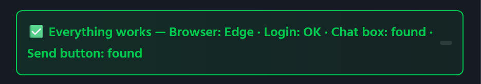
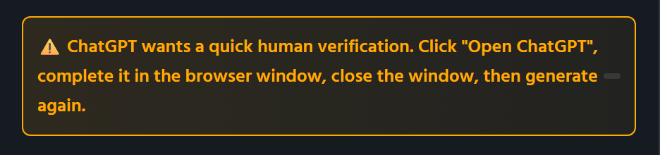
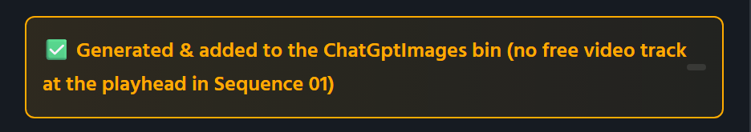

# If something goes wrong

Find the symptom, or the message the status bar shows. *Written for
Lazy-Image 2.6.* The status bar under the preview always says what just
happened or why something did not. Orange means ChatGPT or the panel needs
something from you; red means something failed.

**Contents**

- [First: click Test](#first-click-test)
- [Installing and opening the panel](#installing-and-opening-the-panel)
- [Logging in](#logging-in)
- [Generating](#generating)
- [The image and the timeline](#the-image-and-the-timeline)
- [The browser](#the-browser)
- [Status bar messages](#status-bar-messages)
- [Reporting a problem](#reporting-a-problem)

---

## First: click Test

**🔍 Test** in the header runs the whole path in a few seconds without using
an image: which browser is used, whether the ChatGPT login is valid, whether
ChatGPT's chat box and send button can be found. Its one-line report tells
you which of the four to look at, and the fixes below are grouped the same
way.

---

## Installing and opening the panel

### Lazy-Image is not in Window › Extensions

- Restart the app completely. Adobe only looks for panels while it starts.
- Check the panel is there:
  `%APPDATA%\Adobe\CEP\extensions\com.gimage.aftereffects\CSXS\manifest.xml`.
  If not, run `install.bat` again from inside the unzipped folder, with both
  apps closed.
- Your app must be After Effects CC 2019 (16.0) or Premiere Pro CC 2019
  (13.0) or newer.

### The installer says the old panel could not be removed

After Effects or Premiere Pro is still running and holding the files. Close
both (check the system tray and Task Manager for a leftover process) and run
`install.bat` again.

### The installer says there is no .zxp next to it

`install.bat` was moved out of the unzipped folder, or the zip was opened
without being extracted. Unzip the whole download to a folder and run
`install.bat` from inside it.

### The panel opens blank

On some computers Adobe's signature check fails even for a correctly signed
panel. Run **`Fix a blank panel.bat`** from the download and restart the app.
It turns on Adobe's own *PlayerDebugMode* for your user account, which lets
the app load the panel anyway. If it is still blank, see
[Reporting a problem](#reporting-a-problem).

### The header says the wrong app

The tag next to the name reads **After Effects** or **Premiere Pro**
according to the app the panel is running in. The same panel serves both;
open it from the other app's Window › Extensions menu to see the other tag.

---

## Logging in

### "Login required" although I am logged in to ChatGPT in my browser

Lazy-Image uses its **own** browser profile, so your everyday browser's
login does not count. Click **🌐 Login to ChatGPT** and log in once in the
window that opens. It closes by itself.

### The login window did not close

- It closes only when it sees you go from logged out to logged in. If you
  were **already** logged in when it opened, the status bar says so and the
  window stays until you close it.
- Still on a sign-in page after logging in (a verification code, a
  *stay signed in?* question)? Finish it; the window closes once ChatGPT
  itself shows you logged in.
- Close the window yourself: Lazy-Image then checks quietly whether the
  login went through and updates the badge.

### "Login was not completed"

The window was closed, or 15 minutes passed, without ChatGPT showing a
session. Click **🌐 Login to ChatGPT** and try again; watch for a
verification step you may have skipped.

### I have to log in again and again

- Each browser has its own Lazy-Image profile. If your **default browser
  changed** (Chrome to Edge, say), log in once in the new one. The Test
  report names the browser in use.
- ChatGPT itself can end a session. Log in once more.
- Something is deleting `%APPDATA%\LazyImage` between sessions (a cleaning
  tool, a roaming-profile reset). Exclude that folder.

### I want to use a different ChatGPT account

Click **🌐 Open ChatGPT** (the button once you are logged in), log out inside
that window, then log in with the other account. The window closes by itself
when the new login is seen.

---

## Generating

### "You are not logged in to ChatGPT"

The saved session has expired or was removed. Click **🌐 Login to ChatGPT**.

### "ChatGPT wants a quick human verification"

Cloudflare's or ChatGPT's *verify you are human* check stayed on screen for
30 seconds. Click **🌐 Open ChatGPT**, complete the check in the window,
close the window, and generate again. This happens more often right after a
fresh login or on a new network.

Orange messages like this one mean nothing is broken: ChatGPT needs
something from you, and the message says what.

### "ChatGPT is showing a message that needs your attention"

A dialog on ChatGPT (updated terms, a new-feature notice, a warning) did not
go away when Escape was pressed. The message quotes its text. Click **🌐 Open
ChatGPT**, deal with it there, close the window and generate again.

### "ChatGPT has hit a usage limit"

Your ChatGPT account has used up its images or messages for now; the message
quotes ChatGPT's own wording, which usually says when the limit resets. Wait
for it, or use a paid ChatGPT plan. Lazy-Image cannot get around ChatGPT's
limits; it simply uses your account.

### "ChatGPT flagged this session"

ChatGPT reported *unusual activity* for the account. Click **🌐 Open
ChatGPT**, look at what it shows in the window and follow it, then try again
later. Generating many images in quick succession makes this more likely.

### "ChatGPT reported an error"

ChatGPT itself failed (*something went wrong*, *error in message stream*, a
network error). This kind of failure is retried once by itself before you see
the message. Try again in a moment; if ChatGPT's own website is down, wait.

### "ChatGPT declined to create this image"

ChatGPT refused the prompt on content grounds and said so; the message
quotes its reply. Reword the prompt.

### "ChatGPT replied without an image"

ChatGPT answered with text only (a question, a description, a suggestion) and
did not add an image within 45 seconds. The message quotes the reply. Make
the prompt more clearly a request for a picture, for example start with *An
illustration of…*; the preamble Lazy-Image adds already asks ChatGPT not to
ask follow-up questions.

### "ChatGPT did not finish loading"

chatgpt.com did not become usable within a minute. Check your connection, or
whether chatgpt.com opens in a normal browser at all, and try again.

### "No image arrived within 6 minutes"

ChatGPT was still busy, or the image never came. Open chatgpt.com in your
own browser to see whether the conversation got an image after all (it will
be in your history); if so, ChatGPT was slow and a second try usually works.

### "ChatGPT did not accept the prompt" / "Could not type the prompt into ChatGPT"

The text did not land in the chat box, or Send did nothing. Try again; if it
repeats, run **🔍 Test** and see whether the chat box and send button are
found. If they are not, see the next entry.

### "Lazy-Image could not find ChatGPT's chat box. ChatGPT has most likely changed its website"

ChatGPT redesigned its page and none of the known ways of finding the chat
box or the send button match any more. Nothing is wrong on your side. Check
the [releases page](https://github.com/raisulsohan/LazyImageGeneration/releases)
for a newer Lazy-Image, and if there is none yet,
[report it](#reporting-a-problem) so it can be fixed.

### "Lazy-Image is already working"

A generation, test or login is still running (the browser is open). Wait for
it to finish, or press **✕ Cancel**.

### "Wait for the connection test to finish" / "Finish the ChatGPT login … first"

Generate was clicked while **🔍 Test** or the login window was busy. Wait a
moment, or close the login window.

### "Please enter an image prompt"

The prompt box is empty.

### Generation is slow

Almost all of the time is ChatGPT drawing, which Lazy-Image cannot speed up.
Starting the hidden browser and loading ChatGPT takes a few seconds on top.
The percentage is an estimate from your recent images, so the first few
runs may look off.

### The progress percentage sticks around 95 %

That is by design: ChatGPT reports no real progress, and the estimate creeps
towards 95 % until the image arrives rather than pretending to be done.

---

## The image and the timeline

### "Generated & imported into ChatGptImages (open a comp / sequence to add it to the timeline)"

No composition (After Effects) or sequence (Premiere Pro) was open. The image
is in the project's `ChatGptImages` folder or bin; open the timeline and drag
it in, or open it first next time.

### Premiere Pro: "no free video track at the playhead"

Every video track has a clip inside the still's time span at the playhead,
and a new track could not be added. The image is in the `ChatGptImages` bin;
drag it onto the sequence. Lazy-Image never overwrites or moves your clips.

### After Effects: the layer went into the wrong composition

If the panel has the focus, After Effects may report no active composition,
and Lazy-Image then uses the first composition in the project. Click into the
composition you want before generating, or move the layer.

### "Saved to disk. … import: …" / "Saved to disk, but … could not import it"

The image is in the `chatgptimages` folder (📂 Open Folder), but the app
refused the import; the message carries the app's reason. Import the file by
hand, and [report](#reporting-a-problem) the message if it repeats.

### The images went to Documents\chatgptimages

The project had not been saved when the image was made, so there was no
project folder. Save the project first; the next image goes beside it.

### The image is in the project twice

Each generation imports its own new file, so two images are two items.
Deleting one from the folder on disk shows the *Image removed* toast and
leaves its layer offline; delete the item from the Project panel as well.

### "Image removed" appeared and I did not delete anything

A file disappeared from the watched `chatgptimages` folder: moved, renamed,
or removed by another program (a sync tool, say). Nothing was done by
Lazy-Image; it only tells you.

### Copy Image did nothing, or "Failed to copy"

The image is put on the clipboard through PowerShell. If PowerShell is
blocked on your computer by a company policy, copying cannot work; use
**📂 Open Folder** and copy the file from Explorer instead.

---

## The browser

### "No supported browser was found"

No Chrome, Edge, Brave, Vivaldi or Chromium was found as the default
browser, in the usual install folders or in Windows' *App Paths*. Install
Google Chrome or Microsoft Edge.

### "… closed right after starting" / "… did not start in time" / "Could not open ChatGPT"

The browser was started but did not come up within twenty seconds, or
exited at once. This is retried once by itself. If it keeps happening:

- Another program (security software) may be blocking the browser from
  starting with a remote debugging port. Allow it.
- The profile may be broken. Delete `%APPDATA%\LazyImage\<Browser>Profile`
  and log in again.
- Try starting the browser normally once, so any pending update finishes.

### "The browser closed unexpectedly"

The browser exited in the middle of a generation, usually a crash or a
browser update installing itself. Retried once by itself; try again.

### A browser window flashed up during a generation

The window is started hidden and should never show. If it does, tell me
(see below) which browser and Windows version you have. The one-time login
window is meant to be visible.

### The browser took the keyboard focus from the app

Lazy-Image locks the foreground for fifteen seconds while the browser starts,
re-asserting it every half second. Windows lifts that lock when you click or
press a key at the wrong moment, and a very slow start can outlast it.
Please report it with your browser and Windows version if it happens
regularly.

### A browser keeps running after I close the panel

It should not: closing the panel kills the browser it owns, and a stale
browser on Lazy-Image's profile is closed at the next start. Check Task
Manager for a `chrome.exe` / `msedge.exe` whose command line mentions
`LazyImage` and end it; then report it.

---

## Status bar messages

The messages you may see, and what they mean. `…` stands for text that
varies.

### Login and Test

| Message | Meaning |
| --- | --- |
| Opening a browser window for ChatGPT... | The login window is starting. |
| 🌐 Log in to ChatGPT in the … window — it closes by itself when you are done. | The window is open; log in there. |
| ✅ You are already logged in. Close the browser window when you are done. | The profile was logged in already; the window is yours to use and close. |
| Checking your ChatGPT login... | The window was closed without a login being seen; a hidden check is running. |
| ✅ Logged in to ChatGPT! Generate images right here — no browser needed. | Done. |
| ⚠️ Login was not completed. Click "Login to ChatGPT" to try again. | No session was seen. |
| 🔍 Testing the ChatGPT connection… | Test is running. |
| ✅ Everything works — Browser: … · Login: OK · Chat box: found · Send button: found | All four checks passed. |
| ⚠️ Browser: … · Login: … · Chat box: … · Send button: … — … | A check failed; the reason follows. |

### Generating

| Message | Meaning |
| --- | --- |
| 🔄 Starting ChatGPT in the background… 2% | The hidden browser is starting. |
| 🔄 Loading ChatGPT… 6% | chatgpt.com is loading. |
| 🔄 Sending prompt… 10% | The prompt is being typed and sent. |
| 🔄 ChatGPT is creating your image… …% | ChatGPT is drawing; the percentage is an estimate. |
| 🔄 ChatGPT hiccuped — trying once more… | A transient failure; the attempt is repeated once. |
| 🔄 Downloading image… 97% | Fetching the finished image. |
| Saving image to project folder... | Writing the file. |
| Cancelling... / Generation cancelled. | You pressed ✕ Cancel. |
| ⚠️ You are not logged in to ChatGPT. Click "Login to ChatGPT" first. | See [Logging in](#logging-in). |
| ⚠️ ChatGPT wants a quick human verification. … | See [above](#chatgpt-wants-a-quick-human-verification). |
| ⚠️ ChatGPT is showing a message that needs your attention ("…"). … | A dialog on ChatGPT; handle it through Open ChatGPT. |
| ⚠️ ChatGPT has hit a usage limit: "…" — wait for it to reset and try again. | Your account's limit. |
| ⚠️ ChatGPT flagged this session: "…" — click "Open ChatGPT", check the browser window, then try again. | ChatGPT reported unusual activity. |
| ⚠️ ChatGPT declined to create this image: "…" | A content refusal. |
| ⚠️ ChatGPT replied without an image: "…" | A text-only answer. |
| ⚠️ Lazy-Image could not find ChatGPT's chat box. ChatGPT has most likely changed its website — please check for a Lazy-Image update. | ChatGPT redesigned its page. |
| ❌ ChatGPT reported an error: "…" | ChatGPT's own error text, after one retry. |
| ❌ ChatGPT did not finish loading. Check your internet connection and try again. | No usable page within a minute. |
| ❌ No image arrived within 6 minutes. ChatGPT may be busy — please try again. | Timed out. |
| ❌ ChatGPT did not accept the prompt. Please try again. / ❌ Could not type the prompt into ChatGPT. | Sending failed. |
| ❌ The image was created but could not be downloaded: … | Both download paths failed. |
| ❌ The browser did not answer (…) | A DevTools command timed out; try again. |
| ❌ No supported browser was found. Please install Google Chrome or Microsoft Edge. | See [The browser](#the-browser). |
| ❌ … closed right after starting. / … did not start in time. / Could not open ChatGPT. | The browser did not come up, after one retry. |
| ❌ The browser closed unexpectedly. Please try again. | The browser exited mid-way, after one retry. |
| ❌ Lazy-Image is already working. Finish or close the current ChatGPT task first. | Another task is running. |
| Wait for the connection test to finish. / Finish the ChatGPT login (or close the browser window) first. / Please enter an image prompt. | Generate was clicked at the wrong moment, or with an empty prompt. |

### After the image

| Message | Meaning |
| --- | --- |
| ✅ Generated & added to timeline (…) | Placed in that composition or sequence. |
| ✅ Generated & added to the ChatGptImages bin (no free video track at the playhead in …) | Premiere Pro: imported, not placed. |
| ✅ Generated & imported into ChatGptImages (open a comp / sequence to add it to the timeline) | No timeline was open. |
| ✅ Saved to disk. … import: … | The app refused the import; its reason follows. |
| ✅ Saved to disk, but … could not import it (…) | The file was not found or the import failed outright. |
| ✅ Image copied to clipboard! / ❌ Failed to copy: … | 📋 Copy Image. |
| 📂 Folder opened / ❌ Failed to open folder: … | 📂 Open Folder. |
| 🗑️ Image removed / 🗑️ N images removed *(toast)* | Files disappeared from the `chatgptimages` folder. |

---

## Reporting a problem

Email **lettertosohan@gmail.com** or
[open an issue](https://github.com/raisulsohan/LazyImageGeneration/issues)
with:

1. The app and its version (After Effects or Premiere Pro, *Help › About*).
2. Your Windows version and your browser (the **🔍 Test** report names it).
3. The Lazy-Image version (under the name in the header).
4. What you did, what you expected, and the **exact status bar message**,
   including the part ChatGPT said in quotes.
5. For a ChatGPT-has-changed problem: the date, so it can be matched to
   ChatGPT's redesign.

Lazy-Image never sends anything anywhere by itself, so there is nothing to
look up on the other end: the details in your message are all there is.
